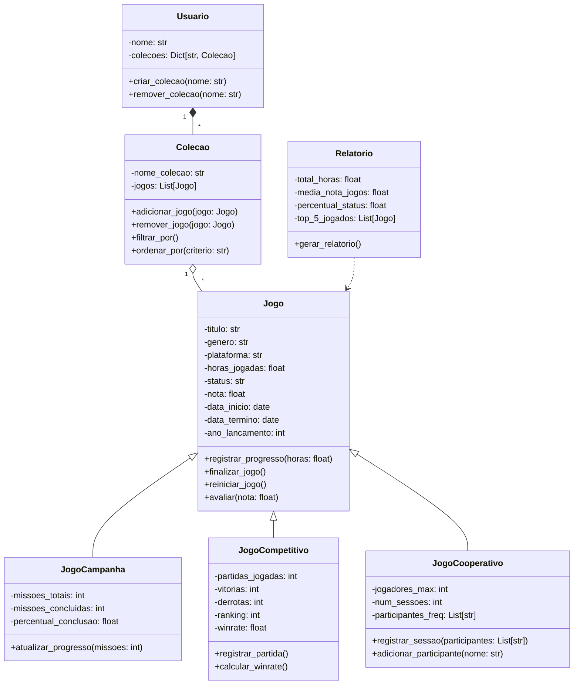

# UML Textual

## Diagrama Visual

## Classe: `Jogo` (Classe Base)

### Atributos

* `- titulo: str`
* `- genero: str`
* `- plataforma: str`
* `- horas_jogadas: float`
* `- status: str`
* `- nota: float`
* `- data_inicio: date`
* `- data_termino: date`
* `- ano_lancamento: int`

### Métodos

* `+ registrar_progresso(horas: float)`
* `+ finalizar_jogo()`
* `+ reiniciar_jogo()`
* `+ avaliar(nota: float)`

---

## Classe: `JogoCampanha` (herda de `Jogo`)

### Atributos

* `- missoes_totais: int`
* `- missoes_concluidas: int`
* `- percentual_conclusao: float`

### Métodos

* `+ atualizar_progresso(missoes: int)`

---

## Classe: `JogoCompetitivo` (herda de `Jogo`)

### Atributos

* `- partidas_jogadas: int`
* `- vitorias: int`
* `- derrotas: int`
* `- ranking: int`
* `- winrate: float`

### Métodos

* `+ registrar_partida()`
* `+ calcular_winrate()`

---

## Classe: `JogoCooperativo` (herda de `Jogo`)

### Atributos

* `- jogadores_max: int`
* `- num_sessoes: int`
* `- participantes_freq: List[str]`

### Métodos

* `+ registrar_sessao(participantes: List[str])`
* `+ adicionar_participante(nome: str)`

---

## Classe: `Colecao`

### Atributos

* `- nome_colecao: str`
* `- jogos: List[Jogo]`

### Métodos

* `+ adicionar_jogo(jogo: Jogo)`
* `+ remover_jogo(jogo: Jogo)`
* `+ filtrar_por()`
* `+ ordenar_por(criterio: str)`

---

## Classe: `Usuario`

### Atributos

* `- nome: str`
* `- colecoes: Dict[str, Colecao]`

### Métodos

* `+ criar_colecao(nome: str)`
* `+ remover_colecao(nome: str)`

---

## Classe: `Relatorio`

### Atributos

* `- total_horas: float`
* `- media_nota_jogos: float`
* `- percentual_status: float`
* `- top_5_jogados: list[Jogo]`

### Métodos

* `+ gerar_relatorio()`
